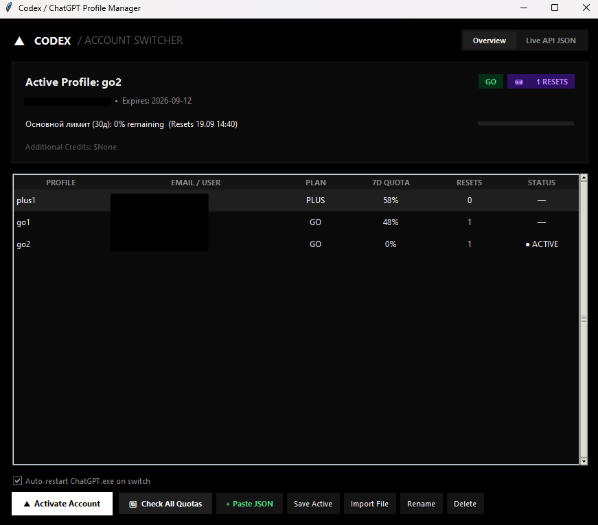

[Русский](README.md) | **English**

# Codex Switcher

GUI profile manager for Codex / ChatGPT: switch accounts via `~/.codex/auth.json`, view email/plan from JWT, import profiles by paste or file, drag-and-drop ordering, bulk export/import of all accounts (ZIP or JSON bundle). All app data is stored in a single folder `~/.codex/codex-switcher/` (auto-migration from legacy `~/.codex/profiles`). Python 3 + Tkinter, no third-party dependencies.



## Installation

Download the installer from [Releases](../../releases):

| File | Platform |
|---|---|
| `CodexSwitcher-x.y.z-setup-x64.exe` | Windows 10/11 (installer) |
| `CodexSwitcher-x.y.z-macos-arm64.dmg` | macOS Apple Silicon |
| `CodexSwitcher-x.y.z-macos-intel.dmg` | macOS Intel |

**macOS:** builds are ad-hoc signed (not notarized). On first launch: right-click the app → "Open", or run
`xattr -cr "/Applications/Codex Switcher.app"`.

## Features

- Profiles table with live quotas (7-day quota, reset tickets)
- One-click activation of `auth.json` + auto-restart of ChatGPT/Codex
- Import: Paste JSON, Import File (single profile)
- **Bulk Export / Import All**: export all profiles to `ZIP` (one file per profile + `profiles_order.json`) or to a `JSON bundle`; import from ZIP/JSON with order preservation and overwrite prompt
- Drag-and-drop sorting with saved order

## Storage

- `~/.codex/auth.json` — active account (shared with Codex CLI)
- `~/.codex/codex-switcher/profiles/*.json` — saved profiles
- `~/.codex/codex-switcher/profiles_order.json` — custom order

Legacy `~/.codex/profiles` and `~/.codex/profiles_order.json` are auto-migrated on first launch.

## Run from source

```bash
python main.py   # Python 3.10+ with tkinter (included in standard builds)
```
